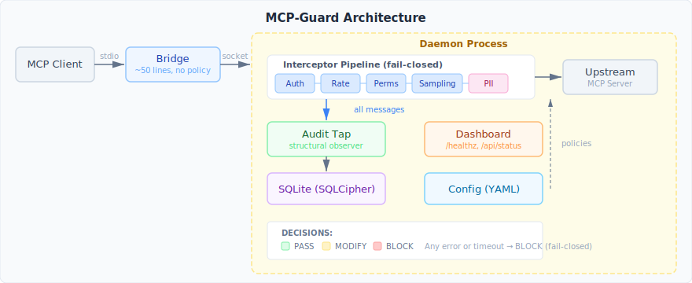

<p align="center">
  
</p>

<h1 align="center">m0lz.03</h1>

<p align="center">
  <strong>MCP-Guard</strong> — Security proxy daemon for MCP servers<br>
  Auth, rate limiting, PII detection, permissions, audit logging<br>
  <a href="https://m0lz.dev/writing/mcp-guard">m0lz.dev/writing/mcp-guard</a>
</p>

---

# MCP-Guard

[](https://github.com/jmolz/mcp-guard/actions/workflows/ci.yml)
[](https://www.npmjs.com/package/mcp-guard)
[](LICENSE)

Security proxy daemon for MCP servers — adds authentication, rate limiting, PII detection, permission scoping, and audit logging without modifying upstream servers.


## What is this?

MCP (Model Context Protocol) servers give AI coding tools access to files, databases, APIs, and more. But they have no built-in authentication, no audit trail, and no way to restrict which tools an agent can call.

MCP-Guard sits between your MCP client (Cursor, Claude Desktop, Claude Code, VS Code) and your MCP servers. It terminates the client connection, inspects every message through a security pipeline, then re-originates the request to the upstream server. Nothing passes through uninspected.

## Key Features

- **Authentication** — OS-level peer credentials, API keys, or OAuth 2.1 with PKCE
- **Rate limiting** — Per-server, per-user, per-tool limits with SQLite persistence
- **Permission scoping** — Allow/deny lists for tools and resources, with capability filtering
- **PII detection** — Regex-based scanning with Luhn validation, bidirectional (request + response)
- **Audit logging** — Every MCP interaction logged to queryable SQLite with optional encryption
- **Role-based policies** — OAuth claims mapped to roles with floor-based policy merge
- **Config composability** — Base configs via `extends` with SHA-256 pinning; personal configs can only restrict
- **Transport support** — stdio, SSE, and Streamable HTTP upstream connections
- **Zero-config start** — Daemon auto-starts on first bridge connection

## Quick Start

```bash
npm install -g @jacobmolz/mcpguard
```

### Option A: Auto-discover existing configs

```bash
mcp-guard init
```

This scans your Claude Desktop, Cursor, VS Code, and Claude Code configs, discovers MCP servers, and generates `mcp-guard.yaml`.

### Option B: Manual config

Create `mcp-guard.yaml`:

```yaml
servers:
  filesystem:
    transport: stdio
    command: npx
    args: ["-y", "@modelcontextprotocol/server-filesystem", "/tmp"]
```

### Update your MCP client

Point your client at MCP-Guard instead of the upstream server:

```json
{
  "mcpServers": {
    "filesystem": {
      "command": "mcp-guard",
      "args": ["connect", "--server", "filesystem"]
    }
  }
}
```

The daemon auto-starts on first connection.

## Architecture



- **Daemon** — Long-running process. Manages upstream connections, runs the interceptor pipeline, owns the SQLite database, serves the health dashboard.
- **Bridge** — Thin stdio relay (~50 lines). Zero policy logic. Structurally fail-closed.
- **CLI** — Stateless commands for management and configuration.

### Security Model

MCP-Guard uses **terminate, inspect, re-originate** — it fully owns both the client and upstream connections. The interceptor pipeline is fail-closed: any error blocks the request. The audit tap is structural (wired outside the pipeline) and cannot be bypassed.

Config merge uses **floor-based semantics**: personal configs can restrict but never relax base policies. `allowed_tools` are intersected, `denied_tools` are unioned, rate limits take the stricter value.

## Why This Matters: MCP Servers Have No Security Layer

### Without MCP-Guard

```
Agent asks to read /home/user/.env via filesystem MCP server
  → Server returns: AWS_SECRET_KEY=wJalrXUtnFEMI/K7MDENG/bPxRfiCYEXAMPLEKEY
  → API key is now in the agent's context window
  → No authentication. No audit trail. No one knows it happened.
```

### With MCP-Guard

```
Agent asks to read /home/user/.env via filesystem MCP server
  → MCP-Guard intercepts the response
  → PII detector matches AWS key pattern → BLOCK
  → Audit log records: blocked response, server=filesystem, pii_type=aws_key
  → Agent receives: "Request blocked by security policy"
```

## Scope

MCP-Guard operates at the **MCP protocol layer** — it inspects JSON-RPC messages between client and server. This is a deliberate architectural boundary.

**What MCP-Guard does not address:**

- **LLM prompt injection** — MCP-Guard does not analyze agent intent. Detecting whether an agent was tricked into making a malicious call requires agent-layer defenses.
- **Model jailbreaking or alignment bypasses** — MCP-Guard does not operate at the model layer. LLM safety is a model-layer concern, not a transport security concern.
- **Network-layer attacks** (MITM, DNS rebinding, TLS stripping) — MCP-Guard does not replace network security. Use standard network security controls.
- **Malicious MCP server implementations** — the proxy limits exposure via permissions and PII scanning, but a compromised server requires remediation at the source.

MCP-Guard is the protocol-layer firewall. It complements agent-layer and network-layer defenses — it doesn't replace them.

## Benchmark Results

The benchmark suite is open-source and fully reproducible (`pnpm benchmark`). It tests MCP-Guard's deterministic interceptor pipeline — policy enforcement, pattern matching, and access control — against 7,095 programmatically generated attack scenarios across 10 categories and 10,168 legitimate requests. See [Benchmark Methodology](docs/benchmark-methodology.md) for threat model, statistical interpretation, and known limitations.

### Per-Category Detection

| Category | Rate | Status |
|----------|------|--------|
| PII response leak | 100.0% | Pass |
| Auth bypass | 100.0% | Pass |
| Sampling injection | 100.0% | Pass |
| Config override | 100.0% | Pass |
| Permission bypass | 98.9% | Pass |
| Capability probe | 97.4% | Pass |
| Resource traversal | 95.4% | Pass |
| PII evasion | 94.7% | Pass |
| PII request leak | 93.8% | Pass |
| Rate limit evasion | 92.4% | Pass |

### Summary

| Metric | Result | Target | Status |
|--------|--------|--------|--------|
| Detection rate | 97.0% | >95% | Pass |
| False positive rate | 0 in 10,168 requests (<0.03% at 95% CI) | <0.1% | Pass |
| Audit integrity | No raw PII in logs | Pass | Pass |
| p50 latency overhead | 0.17ms (deterministic pipeline, no network hop) | <5ms | Pass |

### Limitations

- Tested against own generated scenarios, not an independent corpus — [methodology explains mitigations](docs/benchmark-methodology.md#self-testing-honesty-about-our-own-test-suite)
- Regex PII detection misses semantic encoding (spelling out digits, splitting across fields)
- Does not address LLM-level prompt injection — complementary tools like those evaluated by [MCPSecBench](https://arxiv.org/abs/2508.13220) operate at the agent layer
- No coverage for network-layer attacks (MITM, DNS rebinding)
- ML-based detection planned but not yet implemented

> Full-suite results from `pnpm benchmark`. Quick mode (`pnpm benchmark:quick`) uses stratified sampling and typically reports ~89-93% detection. See [latest report](benchmarks/results/REPORT.md) for charts.

## CLI Reference

| Command | Description |
|---------|-------------|
| `mcp-guard start` | Start daemon (foreground, or `-d` for background) |
| `mcp-guard stop` | Stop running daemon |
| `mcp-guard connect -s <name>` | Start bridge for a server |
| `mcp-guard init` | Generate config from existing MCP client configs |
| `mcp-guard status` | Show daemon status |
| `mcp-guard health` | Liveness check (exit code 0/1) |
| `mcp-guard validate` | Validate config file |
| `mcp-guard logs` | Query audit logs |
| `mcp-guard auth login` | OAuth 2.1 authentication |
| `mcp-guard auth status` | Show token status |
| `mcp-guard auth logout` | Remove stored tokens |
| `mcp-guard dashboard-token` | Display dashboard auth token |

## Configuration

See [`mcp-guard.example.yaml`](mcp-guard.example.yaml) for a complete example.

Key config sections:
- `servers` — Upstream MCP server definitions (command, args, env, transport, policy)
- `daemon` — Socket path, home directory, log level, dashboard port, encryption
- `auth` — Authentication mode (os, api_key, oauth) and role definitions
- `pii` — PII detection settings, custom types, per-type actions
- `audit` — Logging and retention settings

## Docker

```bash
docker build -f docker/Dockerfile -t mcp-guard .
docker run --rm mcp-guard --help
```

Or with docker-compose:

```bash
docker compose -f docker/docker-compose.yml up
```

## Development

```bash
pnpm install
pnpm dev              # Start in dev mode
pnpm test             # Run tests (412 across 38 files)
pnpm lint             # Lint
pnpm typecheck        # Type check
pnpm build            # Production build
pnpm benchmark:quick  # Quick benchmark suite (~30s)
```

## Contributing

See [CONTRIBUTING.md](CONTRIBUTING.md) for development setup and guidelines.

## License

MIT
