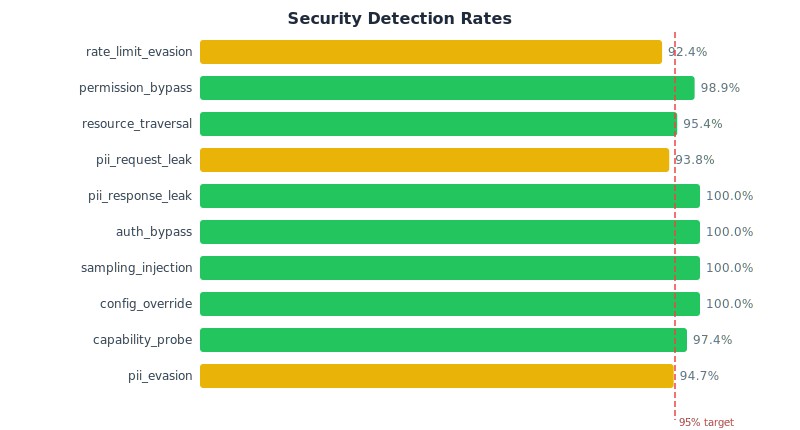
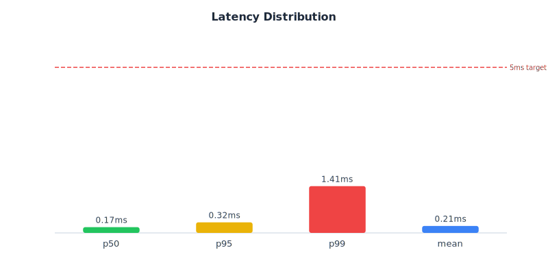
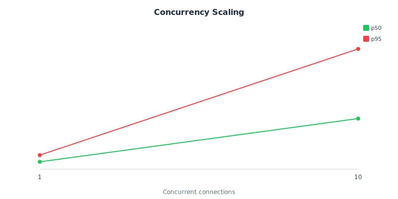

# MCP-Guard Benchmark Report

Generated: 2026-04-08T19:06:41.189Z

## Verdict

| Suite | Result | Details |
|-------|--------|---------|
| Security | ✅ PASS | 95.6% detection (target >95%) |
| Audit Integrity | ✅ PASS | No raw PII in audit logs |
| False Positives | ✅ PASS | 0.000% FP rate (target <0.1%) |
| Performance | ✅ PASS | p50 0.23ms (target <5ms) |

## Methodology

MCP-Guard's interceptor pipeline performs deterministic checks — regex pattern matching (PII), hash/set lookups (permissions, denied tools), counter checks (rate limits), and policy evaluation (sampling guard). These are O(1) or O(n) operations where n is the number of patterns (~20), completing in microseconds. This detection scope explains the results: sub-millisecond latency, high detection on in-scope attacks, and low false positives are *consistent with each other* — the same profile you'd expect from a firewall or rate limiter, not from ML inference.

**Scenario generation:** 10 attack categories × combinatorial axes (tools × servers × techniques × evasion variants) producing 4,500+ unique attack payloads. All scenarios are programmatically generated, not hand-crafted or production-sampled.

**Self-testing transparency:** This benchmark tests MCP-Guard against its own generated scenarios. We acknowledge this openly. Mitigations: (1) every category generator has expected-decision spot-checks in unit tests, (2) the audit integrity verifier confirms no raw PII leaks into logs, (3) detection rates show natural variation (92–100%) because generators include genuinely hard cases, (4) the entire suite is open-source — `pnpm benchmark` reproduces everything.

**What this does NOT test:** LLM-level prompt injection, semantic attacks (encoded PII that doesn't match regex patterns), application-logic exploits, timing side-channels, network-layer attacks (MITM, DNS rebinding).

For full methodology, coverage gap analysis against [MCPSecBench](https://arxiv.org/abs/2508.13220) and [MSB](https://arxiv.org/abs/2510.15994), and statistical interpretation, see [docs/benchmark-methodology.md](../../docs/benchmark-methodology.md).

## Security Detection

| Category | Scenarios | Detected | Rate | Status |
|----------|-----------|----------|------|--------|
| rate_limit_evasion | 554 | 520 | 93.9% | ❌ |
| permission_bypass | 50 | 50 | 100.0% | ✅ |
| resource_traversal | 50 | 47 | 94.0% | ❌ |
| pii_request_leak | 50 | 48 | 96.0% | ✅ |
| pii_response_leak | 50 | 50 | 100.0% | ✅ |
| auth_bypass | 50 | 50 | 100.0% | ✅ |
| sampling_injection | 50 | 50 | 100.0% | ✅ |
| config_override | 50 | 50 | 100.0% | ✅ |
| capability_probe | 50 | 48 | 96.0% | ✅ |
| pii_evasion | 50 | 47 | 94.0% | ❌ |
| **OVERALL** | **1004** | **960** | **95.6%** | ✅ |

## False Positives

- Total requests: 500
- False positives: 0
- FP rate: 0.000% (95% CI upper bound: 0.60%)

### Legitimate Traffic Diversity

- Unique servers: 8
- Unique tools: 23
- Near-PII edge cases: 8
- Request types:
  - tools/call: 361
  - tools/list: 40
  - initialize: 40
  - resources/list: 39
  - resources/read: 20

## Performance

| Metric | Value | Target | Status |
|--------|-------|--------|--------|
| p50 latency | 0.23 ms | <5 ms | ✅ |
| p95 latency | 0.44 ms | — | ℹ️ |
| p99 latency | 1.56 ms | — | ℹ️ |
| Mean latency | 0.29 ms | — | ℹ️ |
| Throughput | 6289 req/s | — | ℹ️ |

### Concurrency Scaling

| Connections | p50 (ms) | p95 (ms) | p99 (ms) |
|-------------|----------|----------|----------|
| 1 | 0.19 | 0.36 | 0.36 |
| 10 | 1.29 | 3.07 | 3.11 |
